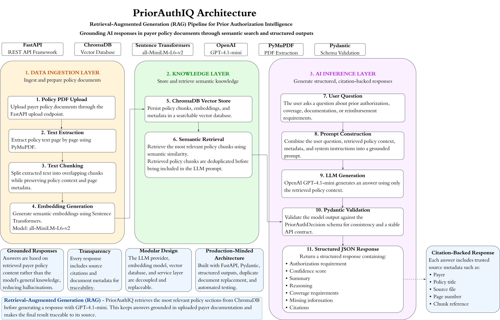

# PriorAuthIQ

<div align="center">

## Enterprise AI-Powered Prior Authorization Intelligence

> **🚧 Status:** MVP • Active Development

**Transform payer policy documents into structured, citation-backed prior authorization intelligence using Retrieval-Augmented Generation (RAG), semantic search, vector embeddings, and Large Language Models.**


</div>

---

## Overview

PriorAuthIQ is an AI-powered healthcare intelligence platform that helps interpret insurance payer policies related to prior authorization, reimbursement, and coverage requirements.

Instead of relying solely on a language model, PriorAuthIQ implements a **Retrieval-Augmented Generation (RAG)** architecture. Relevant policy content is retrieved from a vector database before OpenAI GPT-4.1-mini generates a structured response, improving factual accuracy and grounding every answer in source documentation.

The application automatically:

- Uploads payer policy PDFs
- Extracts and chunks policy text
- Generates semantic embeddings
- Stores documents in ChromaDB
- Retrieves relevant policy context
- Returns structured, citation-backed AI responses through a FastAPI REST API

---

## Why This Project?

Revenue cycle teams spend significant time manually reviewing payer policies to answer questions such as:

- Is prior authorization required?
- What documentation is required?
- What services are covered?
- What reimbursement rules apply?

PriorAuthIQ demonstrates how modern AI engineering techniques—including semantic search, vector databases, and AI-powered retrieval—can streamline this workflow while keeping responses grounded in the original policy documents.

---

## Features

### AI Pipeline

- Retrieval-Augmented Generation (RAG)
- Semantic search
- GPT-4.1-mini integration

### Knowledge Layer

- ChromaDB vector database
- PDF ingestion
- Automatic chunking and embeddings

### API

- FastAPI REST API
- Structured Pydantic responses
- Interactive Swagger documentation

### Quality

- Duplicate document replacement
- Automated testing with Pytest *(in progress)*

---

## System Architecture

PriorAuthIQ follows a modular Retrieval-Augmented Generation (RAG) architecture that ingests payer policy documents, indexes them into a vector database, retrieves relevant policy context, and generates structured, citation-backed responses using **OpenAI GPT-4.1-mini**.

<p align="center">
  
</p>

**Core workflow**

> Policy PDF → Text Extraction → Embeddings → ChromaDB → Semantic Retrieval → GPT-4.1-mini → Structured JSON Response

The diagram above illustrates the complete document ingestion, retrieval, and AI inference pipeline used to produce grounded responses from uploaded payer policy documentation.

---

## Repository Structure

The repository is organized into modular components that separate document ingestion, retrieval, AI inference, API endpoints, and supporting services.

```text
PriorAuthIQ/
├── src/
│   ├── api/                 # FastAPI REST API endpoints
│   ├── config/              # Application configuration and settings
│   ├── ingestion/           # PDF extraction and policy processing
│   ├── llm/                 # OpenAI provider and prompt orchestration
│   ├── models/              # Pydantic request and response schemas
│   ├── rag/                 # Retrieval pipeline and semantic search
│   ├── services/            # Business logic
│   └── utils/               # Shared utility functions
│
├── data/
│   ├── raw_policies/        # Original payer policy PDFs
│   ├── processed/           # Processed policy artifacts
│   ├── sample_policies/     # Sample documents for testing
│   └── vector_store/        # Persistent ChromaDB vector database
│
├── docs/                    # Project documentation
├── images/                  # README diagrams and assets
├── models/                  # Serialized model artifacts
├── notebooks/               # Research and experimentation
├── scripts/                 # Utility scripts
├── tests/                   # Automated test suite
│
├── README.md
├── Dockerfile
├── requirements.txt
├── requirements-dev.txt
└── .gitignore
```
---

## Technology Stack

| Category | Technology |
|-----------|------------|
| Programming Language | Python 3.12 |
| API Framework | FastAPI |
| AI Model | OpenAI GPT-4.1-mini |
| Embedding Model | Sentence Transformers (all-MiniLM-L6-v2) |
| Vector Database | ChromaDB |
| Document Processing | PyMuPDF |
| Data Validation | Pydantic |
| Testing | Pytest |
| Containerization | Docker |

---

## How It Works

PriorAuthIQ processes payer policy documents through a Retrieval-Augmented Generation (RAG) pipeline that combines semantic retrieval with OpenAI GPT-4.1-mini to produce grounded, citation-backed responses.

1. **Upload a policy** – Payer policy PDFs are uploaded and processed by the ingestion pipeline.

2. **Extract document text** – PyMuPDF extracts text while preserving page-level metadata for traceable citations.

3. **Chunk the content** – Documents are split into semantic chunks optimized for vector search.

4. **Generate embeddings** – Sentence Transformers (`all-MiniLM-L6-v2`) converts each chunk into a dense vector representation.

5. **Index the knowledge base** – Embeddings and metadata are stored in ChromaDB for efficient similarity search.

6. **Retrieve relevant context** – When a question is submitted, the most relevant policy sections are retrieved using semantic search.

7. **Construct the prompt** – Retrieved policy context is combined with the user's question to build a grounded prompt.

8. **Generate a structured response** – OpenAI GPT-4.1-mini produces a structured JSON response that conforms to predefined Pydantic schemas.

9. **Return citation-backed results** – The API returns an answer along with supporting citations that reference the original policy document.

This architecture minimizes hallucinations by grounding every generated response in retrieved payer policy documentation rather than relying solely on the language model's pretrained knowledge.

---

## Engineering Decisions

PriorAuthIQ was designed to demonstrate production-oriented AI engineering practices rather than simply integrating a language model. Several architectural decisions were made to improve maintainability, reliability, and transparency.

### Retrieval-Augmented Generation (RAG)

Rather than relying on an LLM's pretrained knowledge, PriorAuthIQ retrieves relevant payer policy content before generating a response. This grounds answers in authoritative documentation and reduces hallucinations.

### Provider Abstraction

The LLM integration is isolated behind a provider interface, making it straightforward to support additional models or providers without changing the application's business logic.

### Structured Outputs

OpenAI responses are validated using Pydantic schemas before being returned by the API. This ensures predictable response formats and simplifies downstream integration.

### Citation-Based Responses

Every answer includes supporting citations that reference the original payer policy document, allowing users to verify the source material behind each response.

### Modular Architecture

The application separates API endpoints, document ingestion, retrieval, prompt construction, AI inference, and business logic into independent modules, making the system easier to maintain and extend.

---

## Installation

## Prerequisites

Before running PriorAuthIQ, ensure the following software is installed:

- Python 3.12+
- Git
- Docker (optional)
- OpenAI API key

---

## Clone the Repository

```bash
git clone https://github.com/AnthonySotoData/PriorAuthIQ.git
cd PriorAuthIQ
```

---

## Create a Virtual Environment

### Windows

```bash
python -m venv .venv
.venv\Scripts\activate
```

### macOS / Linux

```bash
python3 -m venv .venv
source .venv/bin/activate
```

---

## Install Dependencies

```bash
pip install -r requirements.txt
```

For development:

```bash
pip install -r requirements-dev.txt
```

---

## Configure Environment Variables

Create a `.env` file in the project root.

Example:

```env
OPENAI_API_KEY=your_openai_api_key
OPENAI_MODEL=gpt-4.1-mini
```
---

## Running the Application

Start the FastAPI server:

```bash
uvicorn src.main:app --reload
```

The application will be available at:

```
http://127.0.0.1:8000
```

Interactive API documentation:

```
http://127.0.0.1:8000/docs
```

OpenAPI schema:

```
http://127.0.0.1:8000/openapi.json
```
---

## API Endpoints

| Method | Endpoint | Description |
|--------|----------|-------------|
| `GET` | `/` | Returns basic application information and status |
| `GET` | `/health` | Returns the API health status |
| `POST` | `/policies/upload` | Uploads and indexes a payer policy PDF |
| `POST` | `/policies/search` | Searches indexed policy content and returns a structured, citation-backed response |

Interactive Swagger documentation is available at:

```text
http://127.0.0.1:8000/docs
```
---

## Example API Request

The example below demonstrates how to query indexed payer policy documents using the `/policies/search` endpoint.

### Request

```http
POST /policies/search
Content-Type: application/json
```

```json
{
  "query": "Is prior authorization required for CPAP therapy?",
  "payer": "AmeriHealth Caritas Ohio",
  "n_results": 3
}
```
### Response

```json
{
  "authorization_required": true,
  "confidence": 0.94,
  "summary": "Prior authorization is required for CPAP therapy when coverage criteria defined in the payer policy are met.",
  "reasoning": "The uploaded payer policy specifies that CPAP therapy requires prior authorization when medical necessity criteria are satisfied and supporting clinical documentation is provided.",
  "coverage_requirements": [
    "Documentation of medical necessity",
    "Provider prescription",
    "Applicable coverage criteria must be met"
  ],
  "missing_information": [],
  "citations": [
    {
      "payer": "AmeriHealth Caritas Ohio",
      "policy_title": "Durable Medical Equipment",
      "source_file": "sample_policy.pdf",
      "page_number": 12
    }
  ]
}
```

> **Note:** The values above illustrate the structure of a successful response. Actual results depend on the uploaded payer policy and the user's query.

---

## Testing

PriorAuthIQ includes automated tests to validate core application functionality and support future development.

Run the test suite with:

```bash
pytest
```

For verbose output:

```bash
pytest -v
```

The current test suite validates core API functionality and is being expanded as additional features are implemented.

---

---

## Docker

PriorAuthIQ can run inside a Docker container, providing a consistent and portable application environment.

### Build the Docker Image

```bash
docker build -t priorauthiq .
```

### Run the Container

```bash
docker run --name priorauthiq-container -p 8000:8000 --env-file .env priorauthiq
```

Once the container is running, the API is available at:

```text
http://127.0.0.1:8000
```

Interactive API documentation is available at:

```text
http://127.0.0.1:8000/docs
```

The containerized health endpoint was verified successfully:

```json
{
  "status": "healthy"
}
```

### Stop and Remove the Container

Stop the running container with:

```text
Ctrl + C
```

Then remove it with:

```bash
docker rm priorauthiq-container
```
---

## Roadmap

### Version 1.0 (Current MVP)

- [x] FastAPI REST API
- [x] Retrieval-Augmented Generation (RAG)
- [x] ChromaDB vector database
- [x] PDF policy ingestion
- [x] Semantic search
- [x] OpenAI GPT-4.1-mini integration
- [x] Structured JSON responses
- [x] Source citations
- [x] Docker support

### Planned Enhancements

- [ ] Multi-document policy comparison
- [ ] Support for additional LLM providers (Azure OpenAI, Anthropic)
- [ ] Authentication and role-based access
- [ ] Batch policy ingestion
- [ ] Automated policy update detection
- [ ] Advanced confidence scoring
- [ ] Admin dashboard
- [ ] Kubernetes deployment

---

## License

This project is licensed under the MIT License. See the `LICENSE` file for additional details.

---

## About the Author

Anthony Soto is a Data & AI professional with a background in healthcare operations, revenue cycle optimization, and applied machine learning. His work focuses on building practical AI solutions that improve operational efficiency through modern data engineering, Retrieval-Augmented Generation (RAG), and intelligent automation.

PriorAuthIQ was developed as an original portfolio project to demonstrate the design and implementation of production-oriented AI systems using FastAPI, vector databases, semantic search, and large language models.

**Connect with me:**

- GitHub: https://github.com/AnthonySotoData
- LinkedIn: https://www.linkedin.com/in/anthony-soto-a7b68716b/